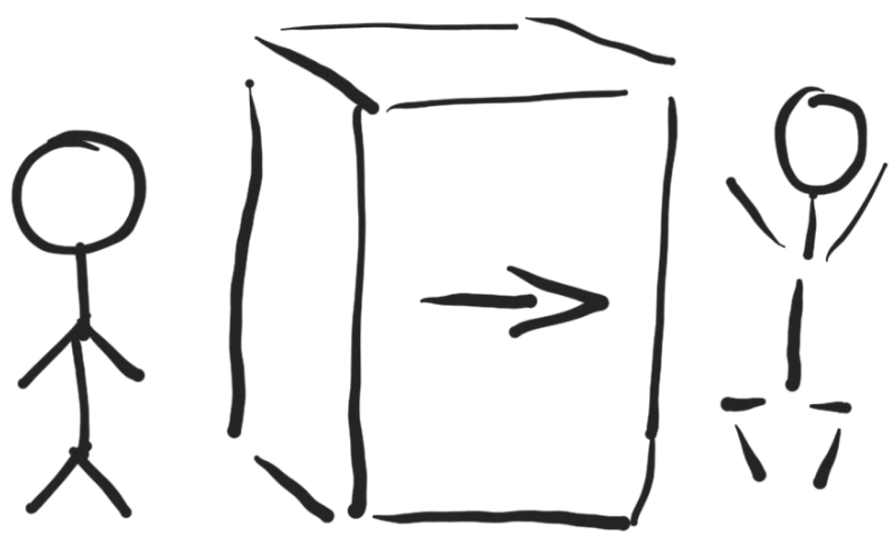

# Motywacja

W motywacji do wszelkiej aktywności warto znać fakty, by pozbyć sie złudzeniom prowadzących do krótkotrwałych uniesień i braku konsekwencji.

## Kim jest programista od strony technicznej
Ktoś kto jest programistą, jest zarazem pisarzem, gdyż używa klawiatury do zapisywania logicznych zdań.
Zdania te trzeba wymyśleć a potem przemyśleć, sprawdzić i wziąć odpowiedzialność za efekty ich działania.

Brzmi strasznie, ale dla tych, którzy lubią programować, to jedynie rezultat.

  

