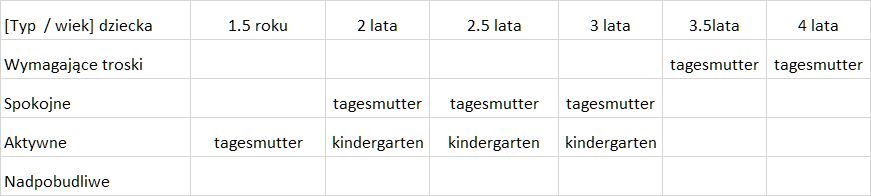

#### Rodzina

w kontekście wyprawy warto rozważyć jak zaplanować przyszłość.
Dla tych, którzy jeszcze nie mają rodziny sprawa jest jednoznaczna, sami decydują.

W przypadku gdy rodzina składa się z dwóch dorosłych osób i pracy obecnej, 
dokonanie wyboru dla jednej strony może być z wielkim oporem.

Dlatego istotna jest nie stan aktualny, ale motywacja do jego zmiany.

Nie istotne czy mamy pracę czy nie.
Isotne, czy cchcemy mieć pracy i mamy szansę na nią w Niemczech.

#### Urodzenie dziecka
Otrzymuję za to wynagroddzenie, urlop macierzyński/tacierzyński to nic nadzwyczajnego,
ale możliwość bycia ojca dziecka na takim urlopie do 12 miesięcy od urodzenia
to wyjątkowy czas, w ramach składek społecznych są wypłacane 65% ostatniego wynagrodzenia,
więc finansowo się to udaje pogodzić.

Oczywiście dla pracodawcy jest to niekorzystna sytuacja, bo traci etat na kilka miesięcy - do roku w przypadku ojca, 
lub nawet do 2 lat w prz\ypadku matki nowonarodzonego dziecka.
Takie prawo mają rodzice w DE i pracodawcy muszą się z tym liczyć.

#### Opieka nad dzieckiem

W Niemczech jest możliwa opieka nad dzieckiem od najwcześniejszego okresu, roku, dwóch  u osósb zajmujących się
codziennie w dni robocze, aby rodzic, rodzice mogli pracować.

Kindergarten również możliwy jest od 2 roku życia

WIele spraw jest możliwych w zależności od umówienia się i od charakteru dziecka.

Np dzieci które są zbyt aktywne trudnioej będzie zostawić pod opieką tagesmutter, bo niewiele osób chce takie dzieci
które sprawiają problemy

z kolei rodzice nie będą chcieli zostawić spokojnych dzieci w kindergarten bo tam będzie zbyt dużo dzieci i zbyt mała ilość czasu dla opiekuna by poświęcić chwilę na konkretne dziecko.
Dlatego lepszym rozwiązaniem jest tagesmutter 
i to taka, która bierze na cały dzień, bo może wtedy wziąć małą grupę.

